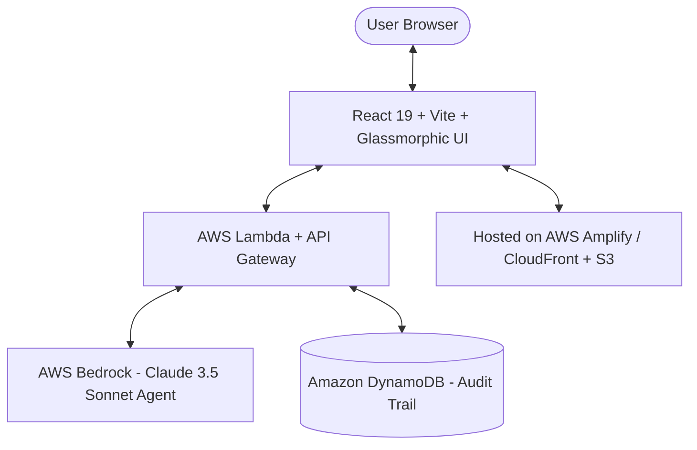

# 🛡️ CloudSentinel AI — Autonomous AWS Infrastructure, Security & Cost Sentinel

[](https://builder.aws.com/build/hackathons/e83e84e5-4f4c-383b-bbe9-4a15ac195d55/zero-to-shipped)
[](https://aws.amazon.com/bedrock/)
[](https://react.dev/)
[](https://vitejs.dev/)
[](https://cloud-sentinel.amplifyapp.com)

> **CloudSentinel AI** is an intelligent, multi-agent cloud copilot powered by **AWS Bedrock (Claude 3.5 Sonnet)** that visually maps live AWS infrastructure, detects cost leaks, automates zero-trust security remediations, and connects directly to the AWS Management Console.

Built for the **AWS Zero to Shipped Hackathon (Sept 18 – Oct 2, 2026)** under the **Workplace Efficiency** app category and **Startup** focus track.

---

## ✨ Key Features

- **🌐 Live AWS Infrastructure Topology Graph**: Interactive SVG canvas rendering VPC subnets, Route 53, CloudFront, ALB, EC2, Bedrock Agents, Lambda, RDS Aurora, DynamoDB, and S3 with node telemetry inspectors.
- **💰 70.7% AWS Cost Leak Reduction ($3,430/mo Savings)**: Recharts-powered spend breakdown identifying overprovisioned compute fleets, idle NAT gateways, unattached EBS volumes, and uncompressed S3 logs.
- **🎉 One-Click Auto-Remediation Engine**: Interactive confetti celebration system executing simulated IAM scripts and updating live metrics instantly.
- **🛡️ Security & Compliance Audit**: Automated scanning against AWS Well-Architected Framework, NIS2, SOC 2, and CIS AWS Foundations with real-time CVSS severity scoring.
- **📜 Multi-Format IaC Code Generator**: One-click generation for **Terraform**, **AWS CloudFormation (YAML)**, and **AWS CDK (TypeScript)** security fixes.
- **⚡ AWS Console Agent Telemetry & Ship Gate Proof**: Complete IAM role assumption trace (`arn:aws:iam::894210584921:role/BedrockConsoleAgentRole`) and live session handshake logs.
- **📝 AWS Builder Center Submission Exporter**: Built-in 1-click Markdown exporter pre-formatted for direct publishing on `builder.aws.com`.

---

## 🏗️ Architecture Diagram



---

## 🛠️ Quick Start (Local Setup)

```bash
# Clone the repository
git clone <your-repo-url>
cd weekend-hacakthon

# Install dependencies
npm install

# Start local dev server
npm run dev

# Open browser at http://localhost:5174/
```

---

## 🚀 1-Click AWS Deployment (Ship Gate Ready)

```bash
# Build production bundle
npm run build

# Deploy via AWS Amplify CLI
npx @aws-amplify/cli hosting add
npx @aws-amplify/cli publish
```

---

## 📄 License

Distributed under the MIT License. See `LICENSE` for more information.
